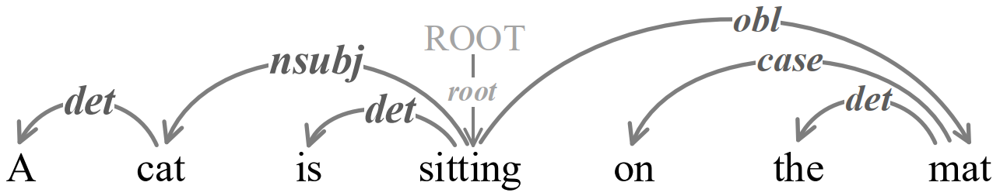

# dependency-parsing
Dependency is a binary asymmetrical relation, which is represented in diagrams by an arrow from the head to the dependent, as shown in below. 

This repository is about a re-implementation about some dependency parsing methods.
There have been two major long-established methods for dependency parsing, transition-based parser and graph-based parser.

## Transition-based parser
* Transition-based dependency parsing with stack long short-term memory [pdf](https://aclanthology.org/P15-1033.pdf).
* Simple and accurate dependency parsing using bidirectional LSTM feature representations [pdf](https://transacl.org/ojs/index.php/tacl/article/view/885).
* Globally normalized transition-based neural networks [pdf](https://aclanthology.org/P16-1231.pdf).
* A re-ranking model for dependency parser with recursive convolutional neural network [pdf](https://aclanthology.org/P15-1112.pdf).
* Stack-based multi-layer attention for transition-based dependency parsing [pdf](https://aclanthology.org/D17-1175.pdf).
* Graph-to-Graph Transformer for Transition-based Dependency Parsing [pdf](https://aclanthology.org/2020.findings-emnlp.294.pdf).
* Dependency Parsing with Bottom-up Hierarchical Pointer Networks [pdf](https://arxiv.org/abs/2105.09611).[code](https://github.com/alirezamshi/G2GTr).
* Greedy Transition-Based Dependency Parsing with Stack LSTMs [pdf](https://doi.org/10.1162/COLI_a_00285).
* Tree-Stack LSTM in Transition Based Dependency Parsing [pdf](https://aclanthology.org/K18-2012.pdf).
* Global Transition-based Non-projective Dependency Parsing [pdf](https://aclanthology.org/P18-1248.pdf).

## Graph-based parser
* Enforcing structural diversity in cube-pruned dependency parsing [pdf](https://aclanthology.org/P14-2107.pdf).
* Graph-based dependency parsing with bidirectional LSTM [pdf](https://aclanthology.org/P16-1218.pdf).
* Deep biaffine attention for neural dependency parsing [pdf](https://arxiv.org/pdf/1611.01734.pdf). 
* Improved dependency parsing using implicit word connections learned from unlabeled data [pdf](https://aclanthology.org/D18-1311.pdf).
* Global Greedy Dependency Parsing [pdf](https://ojs.aaai.org//index.php/AAAI/article/view/6348).

## Seq2seq parser
* Seq2seq dependency parsing [pdf](https://aclanthology.org/C18-1271.pdf).
* Dependency Parsing as MRC-based Span-Span Prediction [pdf](https://arxiv.org/abs/2105.07654).

## MRC
* Stack-Pointer Networks for Dependency Parsing  [pdf](https://aclanthology.org/P18-1130.pdf).
* Left-to-Right Dependency Parsing with Pointer Networks  [pdf](https://aclanthology.org/N19-1076.pdf).
* Hierarchical Pointer Net Parsing [pdf](https://aclanthology.org/D19-1093.pdf)
* Head-Driven Phrase Structure Grammar Parsing on Penn Treebank  [pdf](https://aclanthology.org/P19-1230.pdf).
* Effective Representation for Easy-First Dependency Parsin [pdf](https://link.springer.com/content/pdf/10.1007%2F978-3-030-29908-8_28.pdf). [code](https://github.com/bcmi220/erefdp).
* Parsing All: Syntax and Semantics, Dependencies and Spans [pdf](https://aclanthology.org/2020.findings-emnlp.398.pdf).[code](https://github.com/DoodleJZ/ParsingAll).
* Deep Contextualized Word Embeddings in Transition-Based and Graph-Based Dependency Parsing – A Tale of Two Parsers Revisited [pdf](https://arxiv.org/pdf/1908.07397.pdf).
* Diversity-Aware Batch Active Learning for Dependency Parsing [pdf](https://aclanthology.org/2021.naacl-main.207.pdf).
